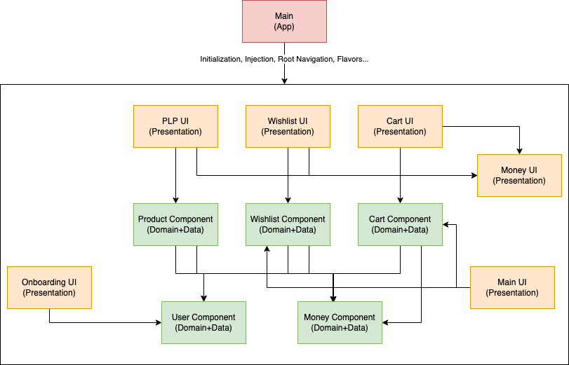

# The Real Clean Architecture in Android - Sample Code

This project demonstrates how to implement Clean Architecture in an Android application, adhering strictly to the SOLID principles. It aims to provide a clear example of Clean Architecture while minimizing the use of third-party libraries.

## Key Concepts

### Dependencies

The project avoids heavy reliance on external libraries, emphasizing simplicity and testability. The **domain layer** is framework-independent, while the **presentation** and **data layers** interface with external frameworks only when necessary. If a framework compromises testability, it is abstracted to ensure that unit testing remains possible.

### Modularization

This project uses a "Package by Component" modularization strategy, dividing the codebase into distinct, feature-driven modules. While the project is small, the modular approach serves as a guideline for scalable applications.

#### Module Types

1.  **Library Modules**  
    These modules provide utilities such as data storage (e.g., SharedPreferences, database) or network requests. They are general-purpose and can be reused across the project.

2.  **Component Modules**  
    Contain the **domain** and **data layers** for a specific feature. These modules have minimal dependencies and are implemented in pure Kotlin or Kotlin Multiplatform for flexibility and reusability. And since they don't depend on the android framework they compile much faster.

3.  **UI Modules**  
    Responsible for the **presentation layer** of a specific feature.
    Slicing this module out ensures that component modules can stay independent while also allowing the UI code to aggregate multiple features in a view.

4.  **App Module**  
    The central module that integrates and orchestrates the other modules.
    All the navigation and DI related code belongs here.

> **Note:** While this project uses a multi-module approach for illustration, such modularization may be unnecessary for smaller projects.

## Module Overview (Alphabetical Order)

### Library Modules

-   **cache**: Provides key-value storage functionality.
-   **cache-test**: Facilitates testing for the cache module.
-   **coroutines-test-dispatcher**: Supplies JUnit rules to assist with coroutine testing.
-   **designsystem**: Contains reusable UI components for the app.
-   **flow-test-observer**: Offers utilities for testing Flow emissions.
-   **foundations**: Adds language utilities not provided by Kotlin.
-   **httpclient**: Handles network requests.
-   **viewmodel**: Provides utilities for working with ViewModels without tight coupling to frameworks.

### Component Modules

-   **cart-component**: Manages the domain and data layers for the cart feature.
-   **money-component**: Defines the `Money` domain object, shared across multiple modules.
-   **product-component**: Contains the domain and data logic for products (used only in PLP for the time being, but it would eventually be used by PDP, search, etc.).
-   **user-component**: Manages the domain and data layers related to user authentication and user data.
-   **wishlist-component**: Handles the domain and data layers for the wishlist feature.

### UI Modules

-   **cart-ui**: Contains the cart feature's presentation layer.
-   **main-ui**: Manages the main screen UI, including bottom navigation.
-   **money-ui**: Provides reusable UI components and logic for displaying prices.
-   **onboarding-ui**: Handles the login screen (it would eventually host also account creation).
-   **plp-ui**: Manages the UI for the Product List Page.
-   **wishlist-ui**: Manages the wishlist feature's UI components.

## Dependency Graph

Below is the dependency graph for the project (library modules omitted for clarity):

